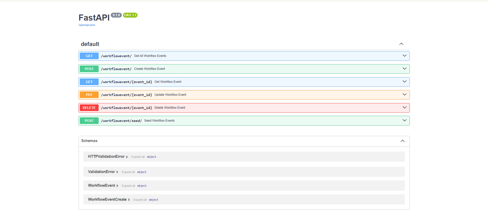

# Тестування працездатності системи

## Передумови

### 1. Встановити залежнсті проекту

```bash
pip show fastapi
pip install -U fastapi
```

### 2. Запустити сервер

```bash
uvicorn src.api.main:app --reload
```

## Перевірка працездатности сервісів

### GET: Виводить список усіх подій (записів) WorkflowEvent з бази даних


### GET: Повертає інформацію про подію WorkflowEvent за вказаним id


### POST: Додає (створює) нову подію WorkflowEvent. У формі потрібно вказати поля: name, status, user_id, quiz_id


### PUT: Оновлює дані обраної події WorkflowEvent за id в базі даних. Можна змінити всі основні поля (name, status, user_id, quiz_id)


### DELETE: Видаляє подію WorkflowEvent із бази даних за вказаним id


### All_Points: Демонструє всі доступні методи API для WorkflowEvent та їхню документацію у Swagger UI

